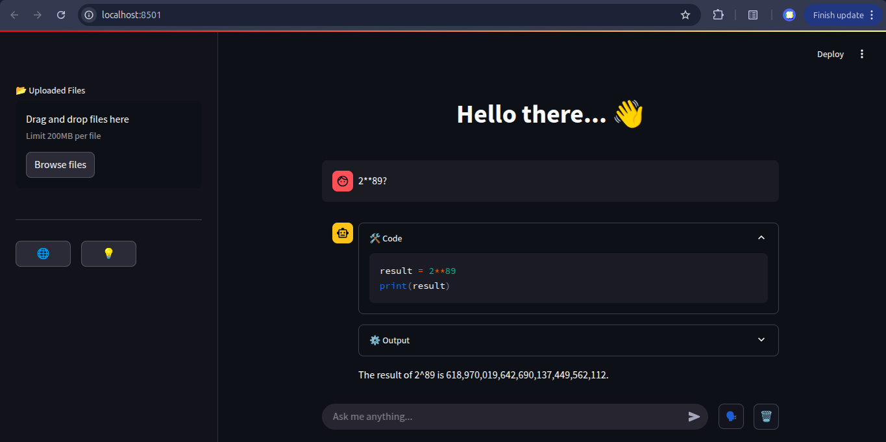

# Code Agent Demo
This repository presents a multimodal, interactive AI assistant powered by a `CodeActAgent` class from [LlamaIndex](https://github.com/jerryjliu/llama_index) and [GroqCloud](https://console.groq.com/home) LLMs. It allows users to interact with an agent capable of executing Python code, handling file uploads, and transcribing voice input.

The UI is built with [Streamlit](https://streamlit.io/), enabling seamless interaction with the agent:


## Features
- 💬 **Chat Interface**: Natural language interaction with the agent through Streamlit's chat UI.
- 🧠 **Code Agent**: Central agent capable of reasoning and executing Python code using Groq LLMs.
- 🗂️ **File Uploads**: Upload multiple files; the agent will read and use them as context.
- 🎙️ **Voice Input**: Use your microphone to ask questions or give commands via speech.
- 🧠 **Memory Persistence**: Conversation memory is retained across queries within the session.
- 🛠️ **Code & Tool Output Handling**: Code and tool outputs are formatted and displayed in expandable sections.

## Getting Started
### Prerequisites
Ensure you have the following installed:
- Python 3.8+
- API key from [GroqCloud](https://console.groq.com/home)

### Installation
1. Clone the repository:
```bash
git clone https://github.com/tobias-nimo/code-agent-demo.git
cd code-agent-demo
```

2. Set up a virtual environment:
```bash
python -m venv venv
source venv/bin/activate
pip install -r requirements.txt
```

3. Install dependencies:
```bash
pip install -r requirements.txt
```

4. Create a `.env` file with the following contents:
```env
API_KEY=your_groq_api_key
ROOT_MODEL=llama3-8b-8192
STT_MODEL=whisper-large
```

### Running the Application
To start the Streamlit application:
```bash
streamlit run src/app.py
```
This will launch the web interface in your default browser, allowing you to interact with the Agent.

## 🗂️ Project Structure
```text
src/
├── app.py              # Main Streamlit app
├── demo_agent.py       # CodeActAgent integration with Groq and LlamaIndex
├── code_executor.py    # Stateful code execution logic
├── multimodal.py       # Voice-to-text transcription via Groq Whisper
```

## Usage
- Ask anything in the chat bar or use your voice via the mic button 🗣️.
- Upload files from the sidebar. The assistant will take them into account during reasoning.
- View code outputs and tool results in expandable sections.
- Clear the chat using the 🗑️ button to start fresh.

## 🧩 Planned Enhancements
- 🌐 Web search integration
- 💡 Reasoning mode
- Image/Video understanding capabilities
