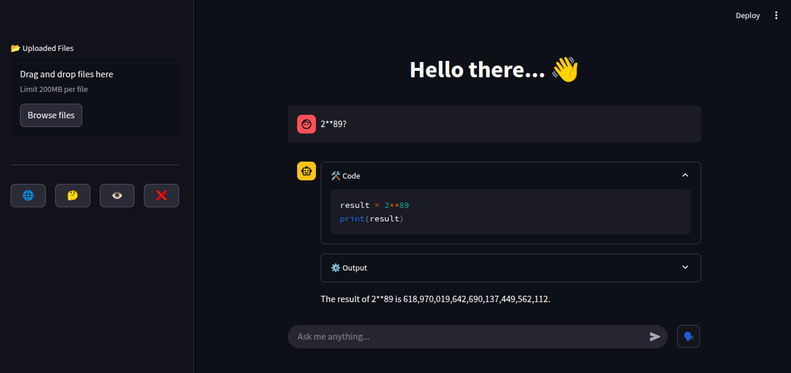

# Code Agent Demo
This repository presents a basic implementation of a `CodeActAgent` leveraging [LlamaIndex](https://github.com/jerryjliu/llama_index) and [Streamlit](https://streamlit.io/). The agent is designed to execute code snippets and provide outputs within an interactive web interface.



## Features
- **CodeActAgent**: Core agent responsible for processing and executing code inputs.
- **LlamaIndex Integration**: Utilizes LlamaIndex for efficient data indexing and retrieval.
- **Streamlit Interface**: Offers a user-friendly web interface for code input and output display.

## Getting Started
### Prerequisites
Ensure you have the following installed:
- Python 3.8 or higher
- pip package manager

### Installation
1. **Clone the repository:**
```bash
git clone https://github.com/tobias-nimo/code-agent-demo.git
cd code-agent-demo
```

2. **Install the required packages:**
```bash
python -m venv venv
source venv/bin/activate
pip install -r requirements.txt
```
### Running the Application
To start the Streamlit application:
```bash
streamlit run src/app.py
```
This will launch the web interface in your default browser, allowing you to interact with the CodeActAgent.

## Project Structure
- `src/`
    - `app.py`: Main entry point for the Streamlit application.
    - `demo_agent.py`: Contains the implementation of the CodeActAgent.
    - `code_executor.py`: Handles the execution of code snippets.
    - `requirements.txt`: Lists all Python dependencies required for the project.

## Usage
Upon running the application, you'll be presented with a web interface where you can input code snippets. The CodeActAgent will process and execute the code, displaying the output directly in the interface.
